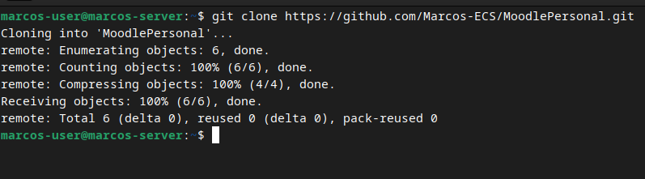
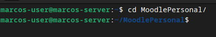
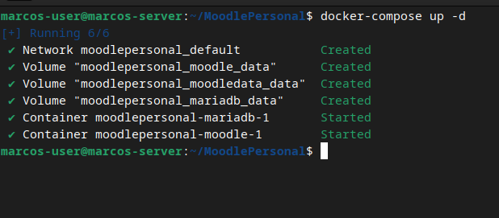
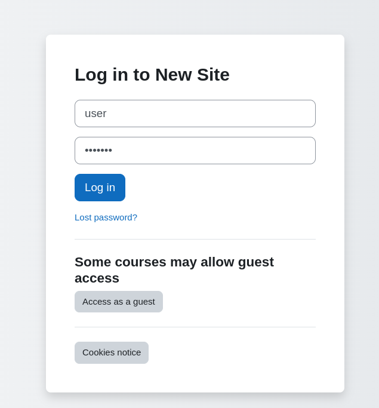
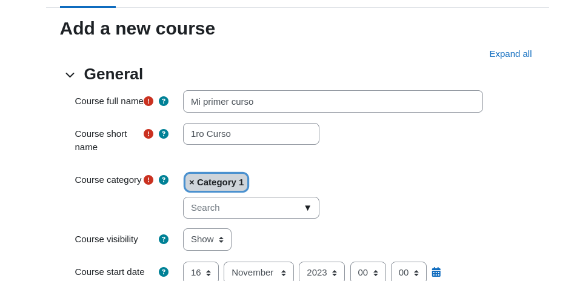
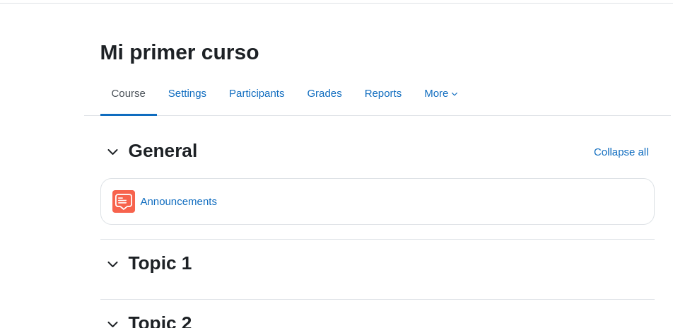

## MoodlePersonal
##  Instalación de moodle

1. Bajar de github a local
git clone https://github.com/Marcos-ECS/MoodlePersonal.git
 

cd MoodlePersonal/

3. Levantar con docker
docker-compose up -d

4. Verificar IP
ip a

5. Configurar moodle

- Ingresamos y hacemos login

- Creamos un nuevo curso
  

- Agregamos los datos requeridos del curso

  
- Y nuestro primer curso en moodle queda concluido
  

