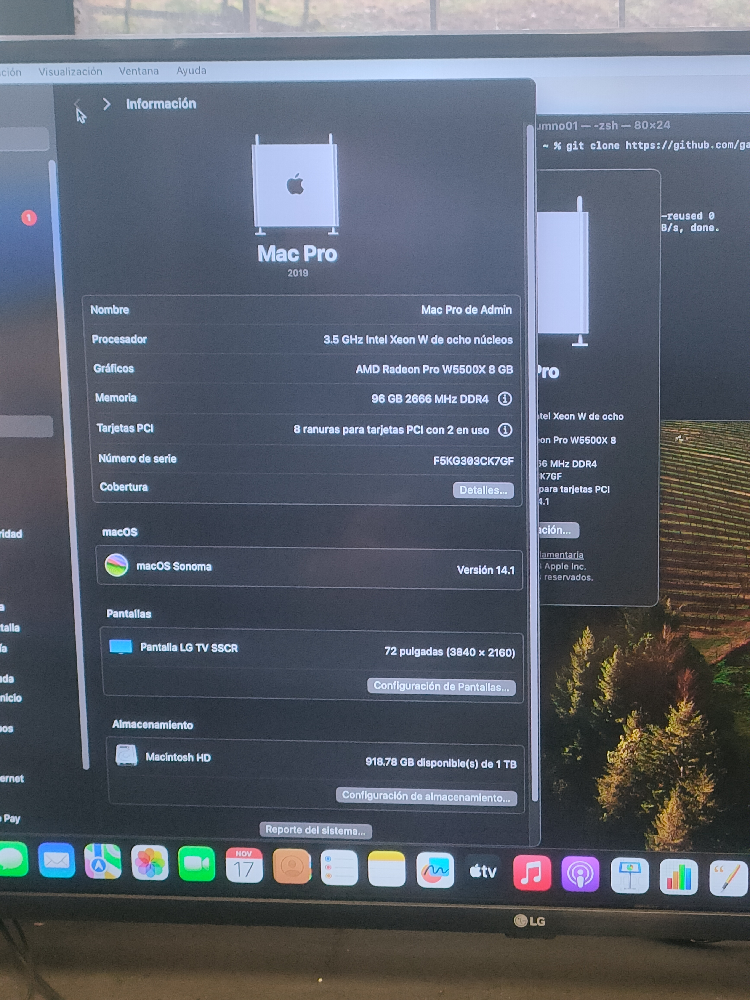
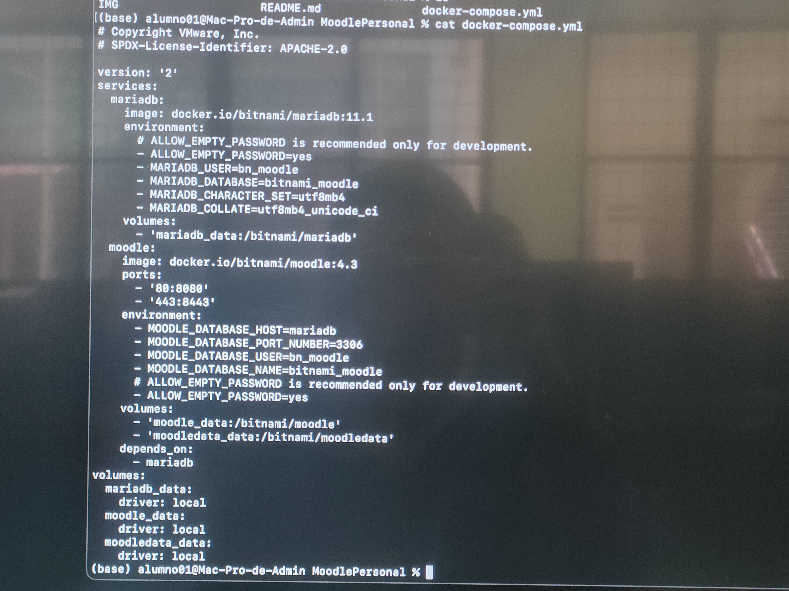
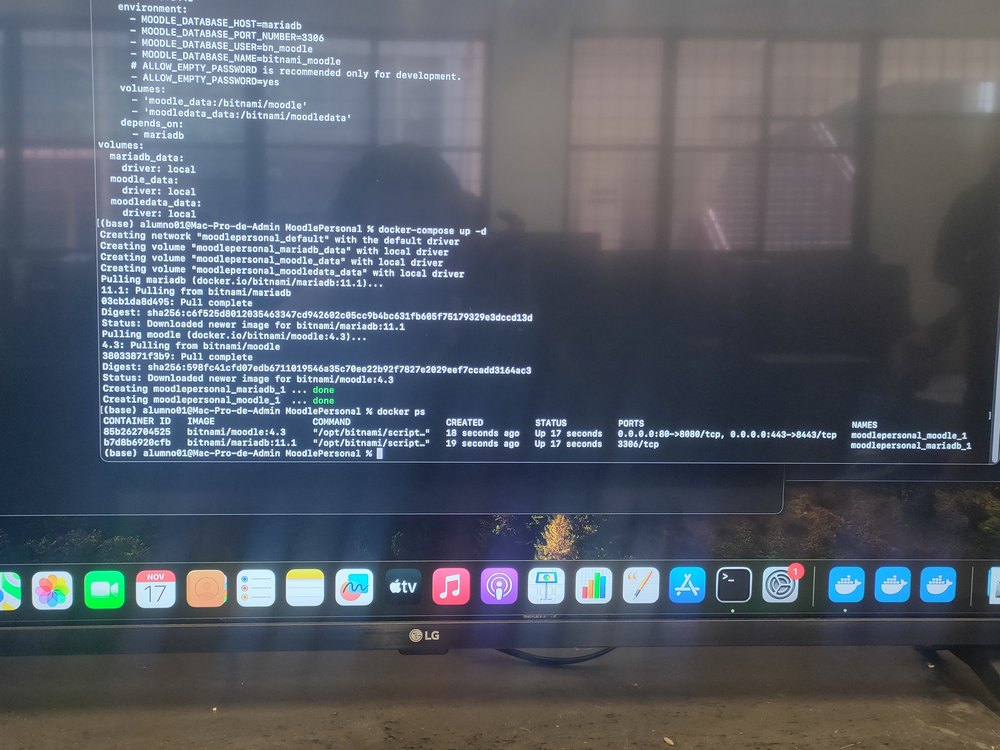
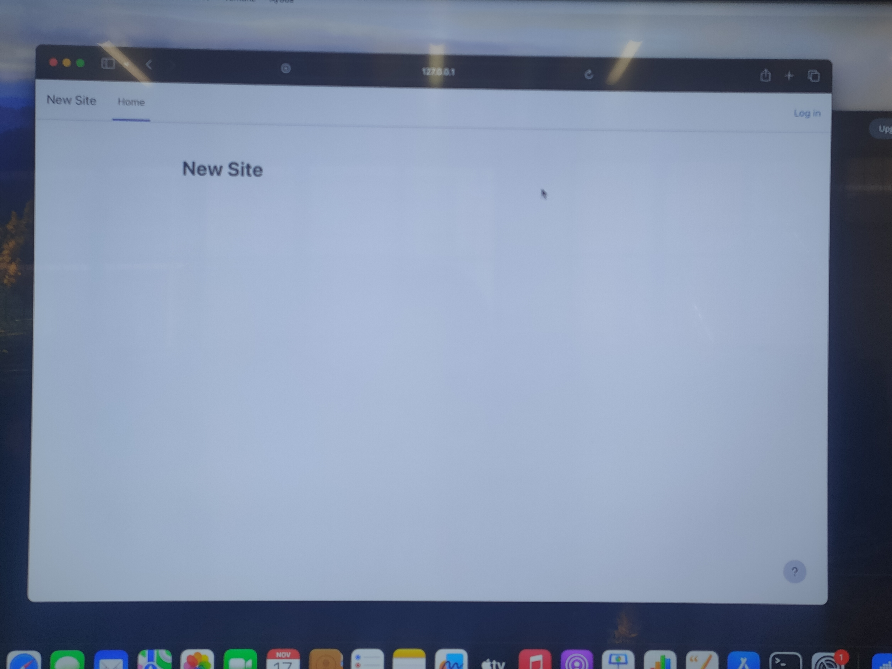
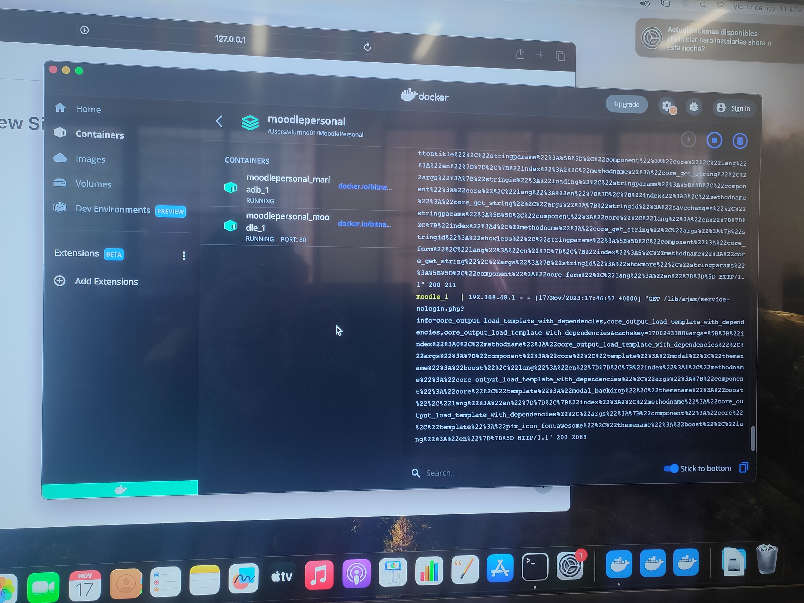
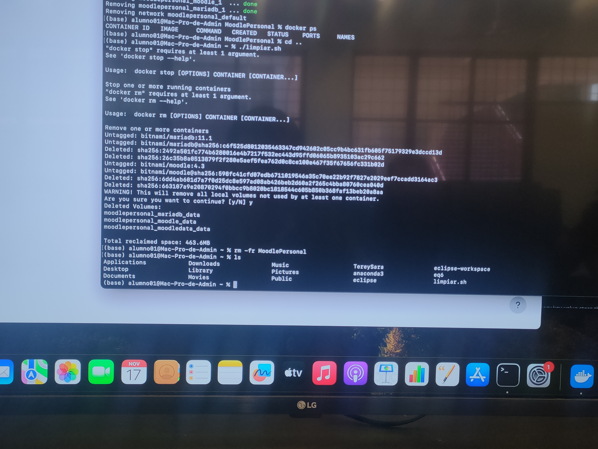

## MoodlePersonal
##  Instalación de moodle

1. Bajar de github a local
git clone https://github.com/Marcos-ECS/MoodlePersonal.git

 

cd MoodlePersonal/

3. Levantar con docker
docker-compose up -d

5. Verificar IP
ip a

6. Configurar moodle

- Ingresamos y hacemos login
  

- Creamos un nuevo curso
  

- Agregamos los datos requeridos del curso

  
- Y nuestro primer curso en moodle queda concluido
  

--------
## Cuestionario Mac OS

1. ¿Qué modelo de Mac?
Mac Pro 2019

2. ¿Cuánta memoria RAM tiene?
96 GB DDR4 a 2666Mhz

3. ¿Qué procesador tiene?
Intel Xeon W

4. ¿Cuántos núcleos tiene?
8 nucleos

5. ¿Cuántos hilos de ejecución tiene?
16 Hilos

-------

## Practica en MAC OS

1. Descargar el repositorio

2. Revisar con CAT el contenido del compose.yml

3. Usar el compose para levantar los contenedores

4. Entrar a la página

5. Revisar que esta corriendo con el docker desktop

6. Limpiar

